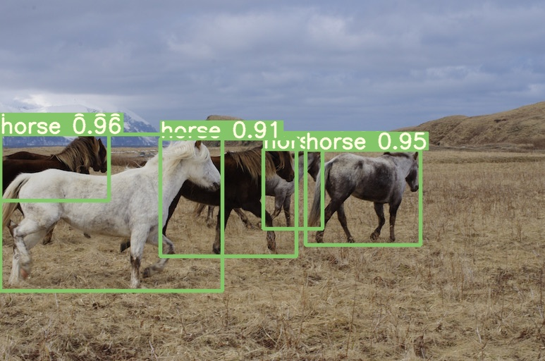

# YOLOv7 with PRBNet

## Performance (test on [c8920ca](https://github.com/pingyang1117/PRBNet_PyTorch/tree/c8920cadfcc52cf194c49c01879bf6807792ac44))

MS COCO

| Model | Test Size | AP<sup>test</sup> | AP<sub>50</sub><sup>test</sup> | AP<sub>75</sub><sup>test</sup> | AP<sub>s</sub><sup>test</sup> |Model Description |
| :-- | :-: | :-: | :-: | :-: | :-: |  :-: |
| **YOLOX-x** | 640 | **51.5%** | **-** | **-** | **-** | - |
| **YOLOv7** | 640 | **51.4%** | **69.7%** | **55.9%** | **31.8%** | [yaml](https://github.com/pingyang1117/PRBNet_PyTorch/blob/main/yolov7_prb/cfg/training/yolov7.yaml)|
|  |  |  |  |  |  |  |  |
| [**YOLOv4-PRB-CSP**](https://drive.google.com/file/d/1vUglmai8lqfiEL2_nJZBZju-tGlrFL0I/view?usp=sharing) | 640 | **51.8%** | **70.0%** | **56.7%** | **32.6%** | [yaml](https://github.com/pingyang1117/PRBNet_PyTorch/blob/main/yolov7_prb/cfg/training/PRB_Series/yolov4-PRB-CSP.yaml)|
| [**YOLOv7-PRB**](https://drive.google.com/file/d/1hhOGyPHogXIe0MrMw9ReJLAuDcvRbdCI/view?usp=sharing) | 640 | **52.5%** | **70.4%** | **57.2%** | **33.4%** | [yaml](https://github.com/pingyang1117/PRBNet_PyTorch/blob/main/yolov7_prb/cfg/training/PRB_Series/yolov7-PRB.yaml) |
|  |  |  |  |  |  |  |  |

## Installation & Getting started

Please refer to the [yolov7 README](./yolov7_README.md) to get started.

## Testing

Tested with: Python 3.8.0, Pytorch 1.12.0+cu117

[`yolov7-prb.pt`](https://drive.google.com/file/d/1hhOGyPHogXIe0MrMw9ReJLAuDcvRbdCI/view?usp=sharing) [`yolov4-prb-csp.pt`](https://drive.google.com/file/d/1vUglmai8lqfiEL2_nJZBZju-tGlrFL0I/view?usp=sharing) 

``` shell
python test.py --data data/coco.yaml --img 640 --batch 32 --conf 0.001 --iou 0.65 --device 0 --weights yolov7-prb.pt --name yolov7-prb_640_val
```

You will get the results:

```
 Average Precision  (AP) @[ IoU=0.50:0.95 | area=   all | maxDets=100 ] = 0.52362
 Average Precision  (AP) @[ IoU=0.50      | area=   all | maxDets=100 ] = 0.70304
 Average Precision  (AP) @[ IoU=0.75      | area=   all | maxDets=100 ] = 0.57118
 Average Precision  (AP) @[ IoU=0.50:0.95 | area= small | maxDets=100 ] = 0.36666
 Average Precision  (AP) @[ IoU=0.50:0.95 | area=medium | maxDets=100 ] = 0.56971
 Average Precision  (AP) @[ IoU=0.50:0.95 | area= large | maxDets=100 ] = 0.66722
 Average Recall     (AR) @[ IoU=0.50:0.95 | area=   all | maxDets=  1 ] = 0.38975
 Average Recall     (AR) @[ IoU=0.50:0.95 | area=   all | maxDets= 10 ] = 0.65053
 Average Recall     (AR) @[ IoU=0.50:0.95 | area=   all | maxDets=100 ] = 0.70243
 Average Recall     (AR) @[ IoU=0.50:0.95 | area= small | maxDets=100 ] = 0.54643
 Average Recall     (AR) @[ IoU=0.50:0.95 | area=medium | maxDets=100 ] = 0.74958
 Average Recall     (AR) @[ IoU=0.50:0.95 | area= large | maxDets=100 ] = 0.84504
```

To measure accuracy, download [COCO-annotations for Pycocotools](http://images.cocodataset.org/annotations/annotations_trainval2017.zip).

## Training

Data preparation

``` shell
bash scripts/get_coco.sh
```

* Download MS COCO dataset images ([train](http://images.cocodataset.org/zips/train2017.zip), [val](http://images.cocodataset.org/zips/val2017.zip), [test](http://images.cocodataset.org/zips/test2017.zip)) and [labels](https://github.com/WongKinYiu/yolov7/releases/download/v0.1/coco2017labels-segments.zip). If you have previously used a different version of YOLO, we strongly recommend that you delete `train2017.cache` and `val2017.cache` files, and redownload [labels](https://github.com/WongKinYiu/yolov7/releases/download/v0.1/coco2017labels-segments.zip) 

Single GPU training

``` shell
# train yolov4-prb-csp models
python train.py --workers 8 --device 0 --batch-size 36 --data data/coco.yaml --epochs 400 --img 640 640 --cfg cfg/training/PRB_Series/yolov4-PRB-CSP.yaml --weights '' --name yolov4-PRB-CSP --hyp data/hyp.scratch.p5.yaml

# train yolov7-prb models
python train.py --workers 8 --device 0 --batch-size 25 --data data/coco.yaml --epochs 400 --img 640 640 --cfg cfg/training/PRB_Series/yolov7-PRB.yaml --weights '' --name yolov7-PRB --hyp data/hyp.scratch.p5.yaml
```

Multiple GPU training

``` shell
# train yolov4-prb-csp models
python -m torch.distributed.launch --nproc_per_node 4 --master_port 9527 train.py --workers 8 --device 0,1,2,3 --sync-bn --batch-size 144 --data data/coco.yaml --img 640 640 --cfg cfg/training/PRB_Series/yolov4-PRB-CSP.yaml --weights '' --name yolov4-PRB-CSP-4GPU --hyp data/hyp.scratch.p5.yaml

# train yolov7-prb models
python -m torch.distributed.launch --nproc_per_node 8 --master_port 9527 train.py --workers 8 --device 0,1,2,3,4,5,6,7 --sync-bn --batch-size 200 --data data/coco.yaml --img 640 640 --cfg cfg/training/PRB_Series/yolov7-PRB.yaml --weights '' --name yolov7-PRB-8GPU --hyp data/hyp.scratch.p5.yaml

```

## Transfer learning

[`yolov4-prb-csp.pt`](https://drive.google.com/file/d/1vUglmai8lqfiEL2_nJZBZju-tGlrFL0I/view?usp=sharing) [`yolov7-prb_training.pt`](https://drive.google.com/file/d/1XQ2hSXq3fAWoH1qBynrMZwYSzPGe78nT/view?usp=sharing) 

Single GPU finetuning for custom dataset

``` shell
# finetune yolov4-prb-csp models
python train.py --workers 8 --device 0 --batch-size 36 --data data/custom.yaml --epochs 400 --img 640 640 --cfg cfg/training/PRB_Series/yolov4-PRB-CSP.yaml --weights 'yolov4-prb-csp.pt' --name yolov4-prb-csp-custom --hyp data/hyp.scratch.custom.yaml

# finetune yolov7-prb models
python train_aux.py --workers 8 --device 0 --batch-size 25 --data data/custom.yaml --epochs 400 --img 640 640 --cfg cfg/training/PRB_Series/yolov7-PRB.yaml --weights 'yolov7-prb_training.pt' --name yolov7-prb-custom --hyp data/hyp.scratch.custom.yaml
```

## Re-parameterization

See [reparameterization-prb.ipynb](reparameterization-prb.ipynb)

## Inference

On video:
``` shell
python detect.py --weights yolov7-prb.pt --conf 0.25 --img-size 640 --source yourvideo.mp4
```

On image:
``` shell
python detect.py --weights yolov7-prb.pt --conf 0.25 --img-size 640 --source inference/images/horses.jpg
```

<div align="center">
    <a href="./">
        
    </a>
</div>

# Updates

- [2022/08/31]: We are still modifying the YOLOv7-PRB structures to attain higher mAP at a lower param/FLOPs size with auxiliary head (IAuxDetect).

## Citation

```
@ARTICLE{9603994,
  author={Chen, Ping-Yang and Chang, Ming-Ching and Hsieh, Jun-Wei and Chen, Yong-Sheng},
  journal={IEEE Transactions on Image Processing}, 
  title={Parallel Residual Bi-Fusion Feature Pyramid Network for Accurate Single-Shot Object Detection}, 
  year={2021},
  volume={30},
  number={},
  pages={9099-9111},
  doi={10.1109/TIP.2021.3118953}}
```

```
@article{wang2022yolov7,
  title={{YOLOv7}: Trainable bag-of-freebies sets new state-of-the-art for real-time object detectors},
  author={Wang, Chien-Yao and Bochkovskiy, Alexey and Liao, Hong-Yuan Mark},
  journal={arXiv preprint arXiv:2207.02696},
  year={2022}
}
```


## Acknowledgements


* https://github.com/WongKinYiu/yolov7


